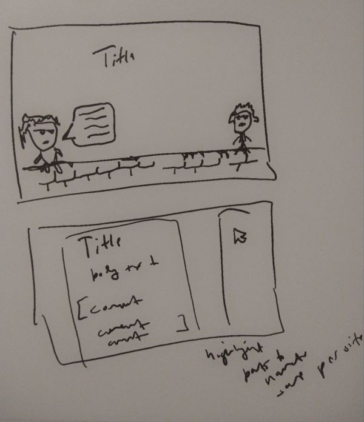

9:34 PM

Man's got Gwen Stefani Flourescent on right now... just popped into my head randomly

hmm feeling a burst of energy right now

I usually always have some form of noise on, YouTube videos, music... something

I want to read stuff but I feel lazy and also want to read things that are helpful/interesting vs. just plain social media eg. memes

I have built both parts of this app before... and I'm just combining two different technologies (chrome extension and text to speech)

Which also none of these things are interesting but the main gimmick is the characters aspect...

The plan is

- you have a page you want to read like some discussion forum
- you outline what part to parse, and verify the parsing pattern eg. ignore miscellaneous text
- then the TTS generates the voice from the text snippets
  - have to verify if I can download sound files into chrome extension in real time first
- the characters are some kind of pixelated anime characters, they can walk around on the screen
  a cute implementation would be a brick wall on the bottom of the page, and the character(s) can sit on it, legs dangling
- the characters read the conversation to each other in different voices

This again is just a way to lazily read stuff

One issue is I don't like AWS Polly's voices... so I'll work on modulating/changing it so it sounds different

I should see how the browser TTS is... I've used it before, it's alright.

It would save on work, I have to see if I can change sound much with JS.

Anyway I want to build this because I'm getting tired of trying to find something to watch on YT

Trying to learn "subconsciously" while I browse the web on my down time (too burnt to work on something)

well... I'm feeling spent lol

let me do a dirty prototype, my BTC price alert used the browser tts

# BTC PRICE ALERT

God that damn sound is engrained my head, I got rekt too by crypto

lol "hey"

okay that part works cool

hmm so close

https://stackoverflow.com/questions/45003548/how-to-capture-generated-audio-from-window-speechsynthesis-speak-call

so... we do have pitch control with utterance cool

https://developer.mozilla.org/en-US/docs/Web/API/SpeechSynthesisUtterance/pitch

I need a japanese anime girl voice of course, and using japanese too so I don't understand what it's saying

No way it does work... kuso lol

Lmao "what a coincidence my name is also..."

Well this basic part works... I gotta design the whole thing still

the height thing will be interesting, youtube for example body css override is ignored, has to be set on ytd-watch-flexy hmm

Oh yeah let me do a dirty prototype, Indie Hackers is a site I wanted to passively read

This won't be the extension part, I can bust that out pretty quickly since I've made a couple already but not now I'm spent already.

I won't use AWS Polly since it's extra complexity for not much gain

I will have a read button, way to define

For example Indie Hackers post with comments

- title
- body
- comments (array)

Dayum it can be 32,767 characters long? wtf

Oh okay 200-300 characters on SO post

Man this is rough I will say

Polly is a little nicer, Kendra Neural in particular damn... so clear

I can build the UI/UX but the web voice might get too annoying to listen to after a while

I've been using the Kendra voice for a while (years) with HN and it too drones on... so maybe it's just natural regarding monotony
